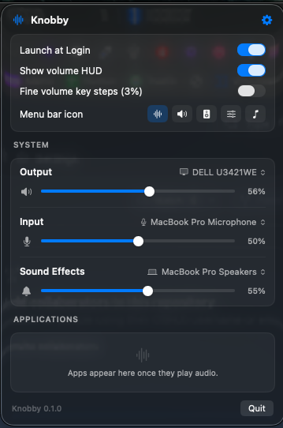

# Knobby

A free, personal SoundSource-style menu bar audio controller for macOS, written in Swift/SwiftUI on top of the Core Audio HAL.

<p align="center">
  
</p>

Built for the clamshell-Mac-with-external-displays setup: HDMI / DisplayPort / USB-C display speakers have no hardware volume control, so Knobby provides **software volume** for them via Core Audio process taps — the same mechanism it uses for per-app volume and per-app output redirection.

## Features

- **Menu bar panel** (no Dock icon) with System and Applications sections.
- **System devices** — pick the Output, Input, and Sound Effects device; adjust volume and mute.
  - Devices without hardware volume (HDMI/DisplayPort displays) automatically get a software volume slider, implemented with a global audio tap. Software volume per device is remembered across launches.
- **Per-app volume** — every app that plays audio shows up with its own slider (Core Audio process tap per app).
- **Per-app redirect** — send any app's audio to a different output device.
- **Keyboard volume keys for HDMI/DisplayPort** — macOS disables the volume keys for displays without hardware volume; Knobby intercepts them (CGEventTap), adjusts the software volume, and shows its own volume bezel. Devices with hardware volume keep the native keys and bezel untouched.
- The per-app taps and the global software-volume tap are exclusion-aware, so audio is never double-rendered.
- **Settings** (⚙ in the panel header):
  - **Launch at Login** (uses `SMAppService`; works when running the bundled app, not `swift run`).
  - **Show volume HUD** — toggle Knobby's volume bezel on/off.
  - **Fine volume key steps** — ~3% per key press instead of the macOS-style ~6%.
  - **Menu bar icon** — pick from several icon styles.

## Install

1. Download the latest `Knobby-x.y.z.zip` from [Releases](https://github.com/n0m4dz/knobby/releases), unzip it, and move `Knobby.app` to `/Applications`.
2. The app is ad-hoc signed (not notarized), so macOS quarantines downloaded copies. Clear the quarantine flag once:

   ```sh
   xattr -cr /Applications/Knobby.app
   ```

   then launch it normally. (Right-click › Open also works on some macOS versions.)

## Requirements

- macOS 14.4 or later (Core Audio process tap API).
- **System Audio Recording permission** — the first time you adjust an app's volume or use software volume, macOS asks for permission (System Settings › Privacy & Security › Screen & System Audio Recording). This is required for taps; nothing is recorded or stored.
- **Accessibility permission** — needed only for the keyboard volume keys on HDMI/DisplayPort outputs (System Settings › Privacy & Security › Accessibility). When running via `swift run`, grant it to the process macOS shows (it may attribute the prompt to your terminal/editor); the bundled app from `make-app.sh` gets its own clean entry.

## Build & run

```sh
./scripts/run.sh       # build + sign + run (use this instead of `swift run`)
```

The script signs the binary with a stable designated requirement (`identifier "com.n0m4dz.knobby"`), so TCC permissions (Accessibility, System Audio Recording) survive rebuilds. A plain `swift run` binary gets a new code hash on every build, which silently invalidates previously granted permissions — the System Settings toggle still shows enabled, but macOS denies the app.

To make a proper app bundle:

```sh
./scripts/make-app.sh  # creates build/Knobby.app
```

Move `build/Knobby.app` to `/Applications`, launch it, and optionally add it to Login Items.

## How it works

- System device state (device list, defaults, volumes) is read and written through the `AudioObject` property API (`Sources/Knobby/Core/CoreAudioSupport.swift`, `AudioDevice.swift`).
- `TapEngine` (`Core/TapEngine.swift`) creates a `CATapDescription` (per-process, or global-excluding), mutes the tapped processes at the HAL, and plays the captured audio back through a private aggregate device with a gain applied in the IO proc.
- `AudioController` (`Core/AudioController.swift`) owns the engines: one optional global engine for software system volume, plus one engine per app whose volume ≠ 100% or which is redirected. Apps with their own engine are excluded from the global tap, and the software system gain is folded into their engine gain instead.

## Roadmap

- 10-band EQ / Audio Unit effects per app
- Favorites / pinned apps
- Balance and sample rate controls
