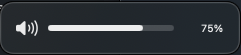

# Knobby

**Take control of every sound on your Mac.**

External audio controller for macOS, built on the Core Audio HAL. Volume for displays that never had it, a personal mixer for every app, and audio routing — all from your menu bar.

<p align="center">
  
</p>

## Volume for displays that don't have it

Using a MacBook in clamshell mode with an external monitor? HDMI, DisplayPort, and USB-C display speakers have no hardware volume control — macOS simply greys out your volume keys. Knobby fixes that with true **software volume**, powered by Core Audio process taps.

Your keyboard volume keys work again, complete with a native-style HUD that glides just like the system bezel:

<p align="center">
  
</p>

Displays that already have hardware volume keep their native keys and bezel — Knobby stays out of the way.

## A mixer for every app

Every app that plays audio gets its own volume slider. Turn the meeting up and the music down — without touching either app.

And when one app belongs somewhere else, **redirect it**: send your browser to the display speakers while everything else stays on your headphones. Per-app taps are exclusion-aware, so audio is never double-rendered, and software volume per device is remembered across launches.

## Everything in one panel

- **Output, Input, and Sound Effects** device pickers with volume and mute — no more digging through System Settings.
- **Menu bar only** — no Dock icon, no clutter.
- **Launch at Login**, so it's always there.
- **Your choice of menu bar icon** and an optional fine 3% volume step for precise control.
- **Volume HUD** can be toggled off if you prefer silence to be silent.

## Privacy

Knobby uses macOS audio taps, which require the **System Audio Recording** permission — audio passes through only to have its volume adjusted; **nothing is ever recorded or stored**. The **Accessibility** permission is needed only to catch the keyboard volume keys. No analytics, no network access, no accounts.

## Download

Free and open source. Grab the latest `Knobby-x.y.z.zip` from [Releases](https://github.com/n0m4dz/knobby/releases), unzip it, and move `Knobby.app` to `/Applications`.

The app is ad-hoc signed (not notarized), so macOS quarantines downloaded copies. Clear the flag once:

```sh
xattr -cr /Applications/Knobby.app
```

then launch it normally. (Right-click › Open also works on some macOS versions.)

**Requires macOS 14.4 or later** (Core Audio process tap API). On first use, macOS will ask for the permissions above in System Settings › Privacy & Security.

## Build from source

```sh
./scripts/run.sh       # build + sign + run (use this instead of `swift run`)
```

The script signs the binary with a stable designated requirement (`identifier "com.n0m4dz.knobby"`), so TCC permissions (Accessibility, System Audio Recording) survive rebuilds. A plain `swift run` binary gets a new code hash on every build, which silently invalidates previously granted permissions — the System Settings toggle still shows enabled, but macOS denies the app.

To make a proper app bundle:

```sh
./scripts/make-app.sh  # creates build/Knobby.app
./scripts/make-icon.sh # re-renders Sources/Knobby/Resources/AppIcon.icns
```

Move `build/Knobby.app` to `/Applications`, launch it, and optionally add it to Login Items.

## Under the hood

- System device state (device list, defaults, volumes) is read and written through the `AudioObject` property API (`Sources/Knobby/Core/CoreAudioSupport.swift`, `AudioDevice.swift`).
- `TapEngine` (`Core/TapEngine.swift`) creates a `CATapDescription` (per-process, or global-excluding), mutes the tapped processes at the HAL, and plays the captured audio back through a private aggregate device with a gain applied in the IO proc.
- `AudioController` (`Core/AudioController.swift`) owns the engines: one optional global engine for software system volume, plus one engine per app whose volume ≠ 100% or which is redirected. Apps with their own engine are excluded from the global tap, and the software system gain is folded into their engine gain instead.

## Roadmap

- 10-band EQ / Audio Unit effects per app
- Favorites / pinned apps
- Balance and sample rate controls
